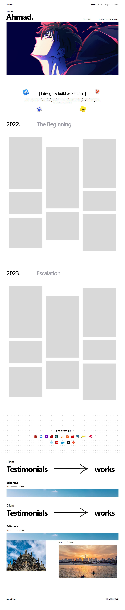

# 🌐 Personal Portfolio Website

Welcome to my personal portfolio website!  
This is a simple and clean portfolio design built using **HTML, CSS, and JavaScript** to showcase my projects, skills, and contact information.

While it’s currently optimized for **desktop view**, mobile responsiveness will be added in future updates. 📌

## 🚀 Live Preview

👉 [View the live website]([https://your-portfolio-link.com](https://ahmadnazish950.github.io/Portfolio/))

---

## 🛠 Tech Stack

- **HTML5**
- **CSS3**
- **JavaScript (Vanilla)**

---

## 🎨 Features

- Clean and minimal UI  
- Smooth scroll and subtle animations  
- Project showcase section  
- Contact form  
- Desktop-first design

---

## 📷 Preview

---

## 📁 Folder Structure
